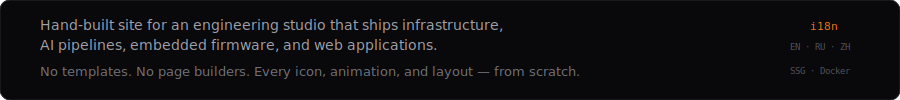
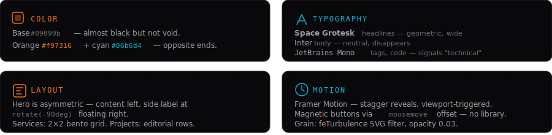
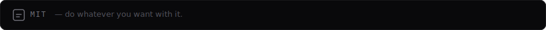

<picture>
  
</picture>

 

<picture>
  
</picture>

 

<picture>
  
</picture>

 

<picture>
  
</picture>

 

<picture>
  
</picture>

 

<picture>
  
</picture>

 

<picture>
  
</picture>

 

<picture>
  
</picture>

 

<picture>
  
</picture>

 

<picture>
  
</picture>

 

<picture>
  
</picture>

 

<picture>
  
</picture>

 

<picture>
  
</picture>

 

<picture>
  
</picture>

 

<picture>
  
</picture>
