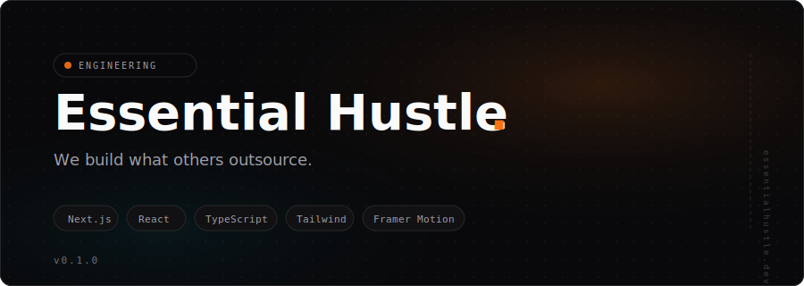
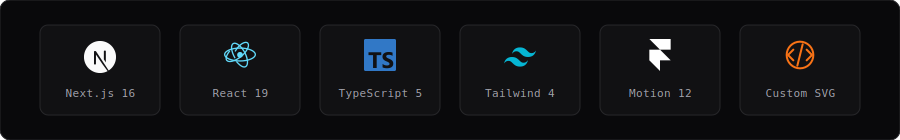

<picture>
  
</picture>

<br />

Site for a small engineering studio that does DevOps, AI, embedded, and web.
Dark theme, custom icons, scroll animations. No templates, no page builders.

```
essentialhustle.dev
```

---

### Stack

<picture>
  
</picture>

---

### How it's built

Everything renders from one config file. No content is hardcoded in components.

```
src/lib/site-config.ts    ← all text, links, project data
src/app/globals.css        ← design tokens (CSS custom properties)
```

Sections are standalone components composed in `page.tsx`:

```
Header → Hero → Services → Projects → About → Contact → Footer
```

Each service icon is hand-drawn SVG on a 24×24 grid, inline in the component.
Animations use Framer Motion with viewport-triggered reveals.
Magnetic button effect tracks cursor position and shifts via `transform: translate`.

---

### Run it

```bash
git clone https://github.com/Call-me-Boris-The-Razor/essential-hustle.git
cd essential-hustle
npm install
npm run dev
```

Needs Node >= 22. Opens on `localhost:3000`.

---

### Files

```
src/
├── app/
│   ├── globals.css             design tokens, grain overlay, scrollbar
│   ├── layout.tsx              3 fonts, metadata, OG tags
│   └── page.tsx                section composition
├── components/
│   ├── header.tsx              sticky nav, mobile menu (AnimatePresence)
│   ├── hero.tsx                headline, dot grid, gradient orbs, CTAs
│   ├── services.tsx            4 cards with custom SVG icons + tags
│   ├── projects.tsx            editorial list, status badges, hover states
│   ├── about.tsx               split layout: text + animated stats
│   ├── contact.tsx             CTA card with radial gradient
│   ├── footer.tsx              brand, nav, GitHub/Telegram SVG icons
│   └── ui/
│       ├── dot-grid.tsx        configurable background dot pattern
│       ├── magnetic-button.tsx cursor-follow effect, focus-visible, a11y
│       └── section-heading.tsx label + title + optional description
└── lib/
    └── site-config.ts          SITE_CONFIG, SERVICES, PROJECTS, ABOUT_TEXT
```

---

### Design decisions

**Palette** — dark base `#09090b`, orange accent `#f97316` for energy, cyan `#06b6d4` for tech contrast. Warm + cool, not same hue family.

**Typography** — Space Grotesk for display (geometric, techy), Inter for body (clean), JetBrains Mono for tags/code. Three fonts with distinct roles, not one font everywhere.

**Layout** — hero is asymmetric (content left, side label right rotated). Services use 2×2 bento grid. Projects use editorial numbered rows, not cards. About splits text/stats into two columns.

**Grain** — SVG noise filter as `::after` pseudo on body. `z-index: 50`, `pointer-events: none`, `opacity: 0.03`. Adds texture without hurting readability.

---

### Environment

```bash
cp .env.example .env.local
```

| Variable | What it does |
|----------|-------------|
| `NEXT_PUBLIC_CONTACT_EMAIL` | Override contact email |
| `NEXT_PUBLIC_GA_ID` | Google Analytics ID |

Both optional. Defaults are in `site-config.ts`.

---

### License

MIT
