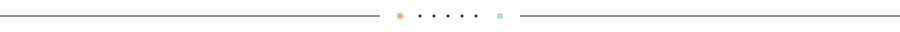
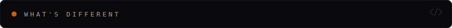
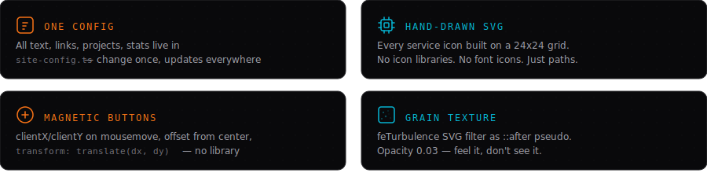
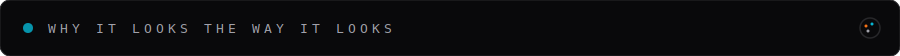
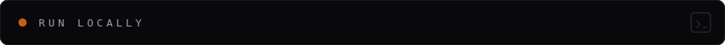
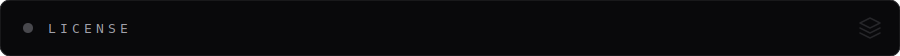

<picture>
  
</picture>

<br />
<br />

We don't use templates. We don't use page builders.
This is a hand-built site for an engineering studio that ships
infrastructure, AI pipelines, embedded firmware, and web apps.

Every pixel, every icon, every animation — written from scratch.

<br />

<picture>
  
</picture>

<br />

<picture>
  
</picture>

<br />

<picture>
  
</picture>

<br />

<picture>
  
</picture>

<br />

<picture>
  
</picture>

<br />

<picture>
  
</picture>

<br />

Dark base is `#09090b` — almost black but not quite.
Pure black (`#000`) feels like a hole in the screen. This has just enough warmth.

Orange `#f97316` paired with cyan `#06b6d4`. Warm energy against cold tech.
Two accents from opposite ends of the spectrum — same hue family
and the whole thing would look monotone.

Three typefaces, three jobs.
**Space Grotesk** for headlines — geometric, techy, wide.
**Inter** for body — neutral, readable, disappears.
**JetBrains Mono** for tags and code — monospace signals "this is technical" without saying it.

Hero is asymmetric on purpose. Content pushes left, a rotated side label floats
right at `rotate(-90deg)`. Services are a `2×2` bento grid, not a list.
Projects are editorial numbered rows — not cards, because cards all look the same.

<br />

<picture>
  
</picture>

<br />

<picture>
  
</picture>

<br />

```bash
git clone https://github.com/Call-me-Boris-The-Razor/essential-hustle.git
cd essential-hustle
npm install
npm run dev
```

Node >= 22. Opens at `localhost:3000`.

Version in the banner SVG syncs from `package.json` automatically via pre-commit hook.
Manual: `npm run version:sync`.

<br />

<picture>
  
</picture>

<br />

<picture>
  
</picture>

<br />

MIT — do whatever you want with it.
